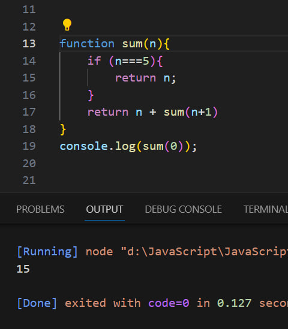

# Что такое Pекурсия в JavaScript?
#### Рекурсия - это когда функция вызывает саму себя до тех пор, пока кто-то ее не остановит. Если никто его не остановит, то он будет повторяться (вызывать сам себя) вечно. Рекурсивные функции позволяют выполнять единицу работы несколько раз. В современных языках программирования, таких как JavaScript, уже есть операторы for и while в качестве альтернативы рекурсивным функциям. Но в некоторых языках, таких как Closure, нет никаких операторов цикла, поэтому вам нужно использовать рекурсию для повторного выполнения фрагмента кода.
>
### ___________________________________
### ___________________________________
###                                    
###                                    
###                                    

>
>
